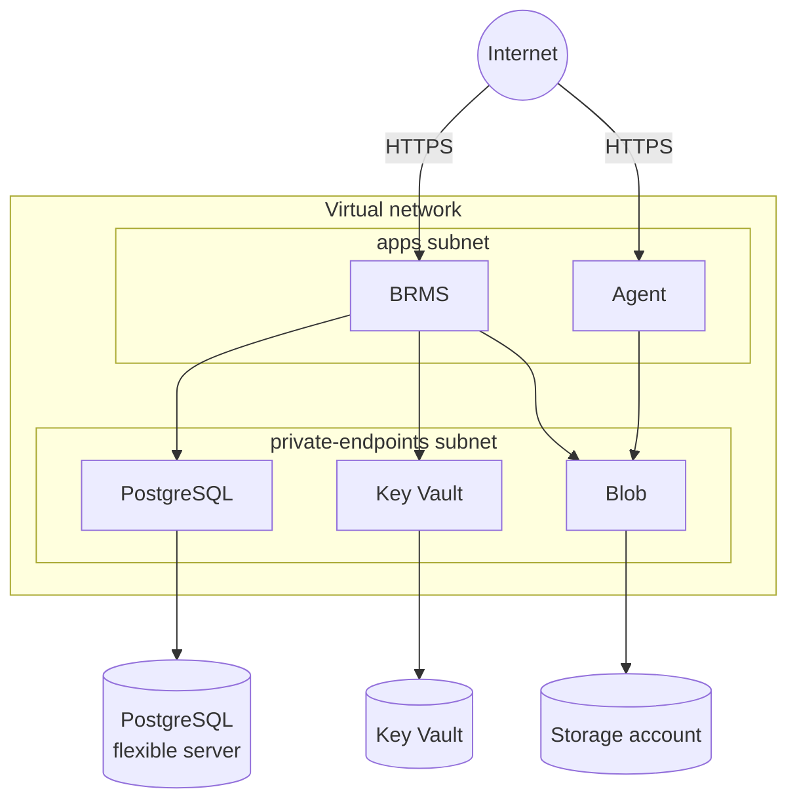

# GoRules Bicep Modules

Bicep modules for deploying [GoRules](https://gorules.io) on Azure Container Apps.

## What is GoRules?

GoRules is a Business Rules Management System (BRMS) for managing and executing business rules. It has two components:

- **BRMS** - Management UI and API for creating, editing, and publishing rules. Requires a database and blob storage.
- **Agent** - Stateless rule execution engine that pulls published rules from blob storage. Scales independently from BRMS.

## Architecture



- BRMS and the Agent run in a Container Apps environment inside the virtual network. Each gets an HTTPS address under `*.azurecontainerapps.io`, so BRMS works without a custom domain.
- PostgreSQL, Key Vault and storage are private, reached through private endpoints.
- The apps use managed identities, not passwords or keys. BRMS signs in to PostgreSQL with Microsoft Entra ID, reads Key Vault and writes to storage. The Agent only reads storage.
- Logs go to a Log Analytics workspace.

## Deployment patterns

| Pattern | Components | Example |
| ------- | ---------- | ------- |
| Full stack | BRMS + Agent + PostgreSQL + Key Vault + storage | [full-stack](examples/full-stack.bicepparam) |
| Agent only | Agent + storage | [agent-only](examples/agent-only.bicepparam) |

## Requirements

| Name | Version |
| ---- | ------- |
| Azure CLI | >= 2.61 |
| Bicep CLI | >= 0.48.1 |
| GoRules Agent | > 2.0.1 |

The deployer needs Contributor and Role Based Access Control Administrator on the resource group, or Owner. Database deletion protection, on by default, adds a lock, which needs Owner or User Access Administrator. A private registry also needs role assignment rights on the registry.

## Quick start

```bash
az group create --name rg-gorules-prod --location swedencentral

export GORULES_LICENSE_KEY=...

az stack group create \
  --name gorules \
  --resource-group rg-gorules-prod \
  --template-file main.bicep \
  --parameters examples/full-stack.bicepparam \
  --action-on-unmanage deleteAll \
  --deny-settings-mode none
```

The `brmsUrl` and `agentUrl` outputs are the HTTPS addresses. To preview changes, run `az deployment group what-if` with the same template and parameters. It skips the Key Vault resources because they take secure parameters.

To remove everything the stack created, first delete the database lock if deletion protection is on:

```bash
az lock delete --name do-not-delete --resource-group rg-gorules-prod \
  --resource-type Microsoft.DBforPostgreSQL/flexibleServers --resource-name <server>

az stack group delete --name gorules --resource-group rg-gorules-prod --action-on-unmanage deleteAll
```

## Parameters

| Name | Default | Description |
| ---- | ------- | ----------- |
| `projectName` | required | Used in resource names. Together with `environmentName` at most 25 characters. |
| `environmentName` | required | Used in resource names, e.g. `dev`, `prod`. |
| `location` | resource group location | Azure region. |
| `tags` | `{}` | Merged with `Project`, `Environment` and `ManagedBy`. |
| `zoneRedundant` | `true` | Spreads the Container Apps environment, storage and a high-availability database across availability zones. Set `false` in regions without zones. Can't be changed later. |
| `network.addressPrefix` | `10.0.0.0/16` | Virtual network range, `/22` or larger. |
| `network.natGateway` | `false` | Sends outbound traffic through a NAT gateway with a static public IP. |
| `storage.versioning` | `true` | Keeps previous versions of overwritten blobs. |
| `containerRegistryId` | none | Azure Container Registry to pull images from with managed identity. |
| `brms` | none | BRMS settings, see below. Omit to skip BRMS. |
| `agent` | none | Agent settings, see below. Omit to skip the Agent. |
| `database` | `{}` | PostgreSQL settings for BRMS, see below. |
| `vault` | `{}` | Key Vault settings for BRMS, see below. |
| `licenseKey` | required with BRMS | GoRules license key. Secure. |
| `aiApiKey` | required with `brms.ai` | API key for the AI provider. Secure. |
| `brmsSecrets` | `{}` | Extra secret environment variables for BRMS, e.g. `{ SSO_OAUTH2_CLIENT_SECRET: '...' }`. Stored in Key Vault. Secure. |

### BRMS and Agent

Both take the same settings, plus the BRMS-only ones marked below.

| Name | Default | Description |
| ---- | ------- | ----------- |
| `image` | `docker.io/gorules/brms:latest`, `docker.io/gorules/agent:latest` | Container image. |
| `cpu` | `1` (BRMS), `0.5` (Agent) | vCPU per replica, `0.25` to `4` in steps of `0.25`. Memory is twice the vCPU in GiB. |
| `minReplicas` | `1` | Use 2 or more with zone redundancy. |
| `maxReplicas` | required | Up to 1000. |
| `cpuTarget` | `60` | Average CPU percentage that triggers scaling. |
| `allowedCidrBlocks` | required | Client ranges allowed in, e.g. `["0.0.0.0/0"]`. |
| `env` | `[]` | Extra environment variables, `[{ name, value }]`. |
| `secretsProvider` | `env` | BRMS only. See [Secrets encryption](#secrets-encryption). |
| `ai` | none | BRMS only. See [AI assistant](#ai-assistant). |

### Database

| Name | Default | Description |
| ---- | ------- | ----------- |
| `version` | `17` | PostgreSQL major version: `16`, `17` or `18`. |
| `sku` | `Standard_B2s` | Compute size. Burstable sizes (`Standard_B*`) suit development; use General Purpose (`Standard_D2ds_v5` and up) for production. |
| `storageSizeGB` | `32` | Grows automatically. |
| `highAvailability` | `false` | Standby replica, zone redundant when `zoneRedundant` is on. Not available on Burstable sizes. |
| `backupRetentionDays` | `7` | 7 to 35. |
| `geoRedundantBackup` | `false` | Copies backups to the paired region. Can't be changed later. |
| `deletionProtection` | `true` | Locks the server against deletion. |

### Key Vault

| Name | Default | Description |
| ---- | ------- | ----------- |
| `softDeleteRetentionDays` | `90` | Days a deleted vault and its secrets can be recovered, 7 to 90. Can't be changed later. |
| `purgeProtection` | `true` | Blocks permanent deletion during the retention period. Can't be turned off once on. |

## Secrets encryption

BRMS encrypts secrets stored in rules with a key that the template creates:

- `env` (default): a random master key, generated once and stored in Key Vault.
- `azure-keyvault`: an RSA key in Key Vault. The key never leaves the vault.

> [!CAUTION]
> **Never delete or rotate the key.** Deleting the master key secret or the RSA key makes all BRMS secrets unreadable. BRMS always uses the newest RSA key version, so rotating it breaks secrets encrypted with an older one. Keep purge protection on in production.
>
> **Choose `secretsProvider` before first use.** Switching it later makes existing BRMS secrets unreadable, and the stack deletes the old master key secret.

The cookie secret and master key are generated on the first deployment only. Later deployments keep them.

## AI assistant

```bicep
param brms = {
  // ...
  ai: {
    provider: 'anthropic'
    model: 'claude-sonnet-4-6'
  }
}
param aiApiKey = readEnvironmentVariable('ANTHROPIC_API_KEY')
```

| Name | Default | Description |
| ---- | ------- | ----------- |
| `provider` | required | `openai`, `anthropic`, `google` or `azure-openai`. |
| `model` | required | Model name, or the deployment name for `azure-openai`. |
| `temperature` | `0.4` | 0 to 2, as a string. |
| `maxOutputTokens` | `32000` | |
| `thinkingLevel` | `medium` | `high` or `medium`. |
| `contextWindow` | none | Overrides the context window size. |
| `azureResourceName` | none | Required for `azure-openai`. |

Container Apps times out requests after 240 seconds, enough for slow first responses from large models.

## Publishing rules

BRMS publishes releases to the `rules` container and the Agent loads them from there. In BRMS, add an environment deployment of type Azure Storage with IAM on, the `storageBlobEndpoint` output as the blob service URL, and `rules` as the container.

Storage only accepts traffic through its private endpoint. A publisher outside this deployment needs network access to it and Storage Blob Data Contributor on the container.

## Container images

Container Apps pulls public images anonymously from Docker Hub, which rate-limits pulls. For production, copy the images to your own Azure Container Registry and set `containerRegistryId` and the `image` fields:

```bash
az acr import --name myregistry --source docker.io/gorules/brms:latest --image gorules/brms:latest
az acr import --name myregistry --source docker.io/gorules/agent:latest --image gorules/agent:latest
```

## License

[MIT](LICENSE)
