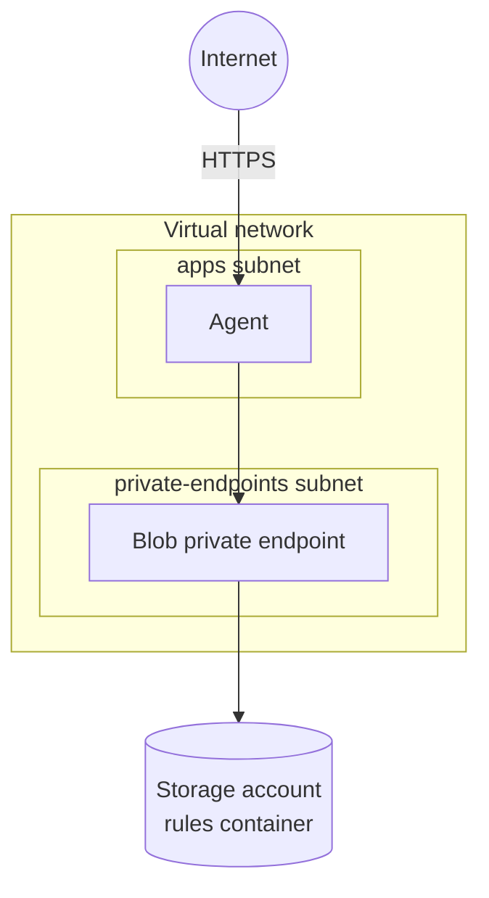

# GoRules Bicep Modules

Bicep modules for deploying [GoRules](https://gorules.io) on Azure Container Apps.

## What is GoRules?

GoRules is a Business Rules Management System (BRMS) for managing and executing business rules. It has two components:

- **BRMS** - Management UI and API for creating, editing, and publishing rules.
- **Agent** - Stateless rule execution engine that pulls published rules from blob storage. Scales independently from BRMS.

## Architecture



- The Agent runs in a Container Apps environment inside the virtual network, on an HTTPS address under `*.azurecontainerapps.io`.
- Storage is private, with shared keys off. The Agent reads it through a private endpoint using its managed identity.
- Logs go to a Log Analytics workspace.

## Requirements

| Name | Version |
| ---- | ------- |
| Azure CLI | >= 2.61 |
| Bicep CLI | >= 0.48.1 |
| GoRules Agent | > 2.0.1 |

The deployer needs Contributor and Role Based Access Control Administrator on the resource group, or Owner. A private registry also needs role assignment rights on the registry.

## Quick start

```bash
az group create --name rg-gorules-prod --location swedencentral

az stack group create \
  --name gorules \
  --resource-group rg-gorules-prod \
  --template-file main.bicep \
  --parameters examples/agent-only.bicepparam \
  --action-on-unmanage deleteAll \
  --deny-settings-mode none
```

The `agentUrl` output is the Agent's HTTPS address. Preview changes first with `az deployment group what-if` using the same template and parameters.

To remove everything the stack created:

```bash
az stack group delete --name gorules --resource-group rg-gorules-prod --action-on-unmanage deleteAll
```

## Parameters

| Name | Default | Description |
| ---- | ------- | ----------- |
| `projectName` | required | Used in resource names. Together with `environmentName` at most 25 characters. |
| `environmentName` | required | Used in resource names, e.g. `dev`, `prod`. |
| `location` | resource group location | Azure region. |
| `tags` | `{}` | Merged with `Project`, `Environment` and `ManagedBy`. |
| `zoneRedundant` | `true` | Spreads the Container Apps environment and storage across availability zones. Set `false` in regions without zones. Can't be changed later. |
| `network.addressPrefix` | `10.0.0.0/16` | Virtual network range, `/22` or larger. |
| `network.natGateway` | `false` | Sends outbound traffic through a NAT gateway with a static public IP. |
| `storage.versioning` | `true` | Keeps previous versions of overwritten blobs. |
| `containerRegistryId` | none | Azure Container Registry to pull images from with managed identity. |
| `agent` | none | Agent settings, see below. Omit to skip the Agent. |

### Agent

| Name | Default | Description |
| ---- | ------- | ----------- |
| `image` | `docker.io/gorules/agent:latest` | Container image. |
| `cpu` | `0.5` | vCPU per replica, `0.25` to `4` in steps of `0.25`. Memory is twice the vCPU in GiB. |
| `minReplicas` | `1` | Use 2 or more with zone redundancy. |
| `maxReplicas` | required | Up to 1000. |
| `cpuTarget` | `60` | Average CPU percentage that triggers scaling. |
| `allowedCidrBlocks` | required | Client ranges allowed to reach the Agent, e.g. `["0.0.0.0/0"]`. |
| `env` | `[]` | Extra environment variables, `[{ name, value }]`. |

## Container images

Container Apps pulls public images anonymously from Docker Hub, which rate-limits pulls. For production, copy the images to your own Azure Container Registry and set `containerRegistryId` and `agent.image`:

```bash
az acr import --name myregistry --source docker.io/gorules/agent:latest --image gorules/agent:latest
```

## Publishing rules

The Agent loads releases from the `rules` container of the `storageAccountName` output. The publisher, usually BRMS, needs Storage Blob Data Contributor on the container and network access to its private endpoint.

## License

[MIT](LICENSE)
